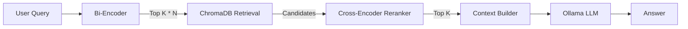

# Rob Burbea Expert

Local-first Retrieval Augmented Generation (RAG) for exploring Rob Burbea's dharma talks with uncensored Ollama-hosted LLMs—no cloud services required.

---

## Vision

Enable deep, citation-backed study of Rob Burbea's teachings by delivering:

- **Semantic search** across hundreds of talks
- **Question answering** powered by local LLMs
- **Comparative insights** between retreats and time periods
- **Traceable references** that point to specific talks and timestamps

_Current pilot scope: 32 talks from the 2019-2020 "Practising the Jhānas" retreat._

---

## Architecture Overview

We use a **Two-Stage Retrieval** pipeline to balance speed (High Recall) with accuracy (High Precision).



| Component | Role |
|---|---|
| **Bi-Encoder** | Fast vector search (MiniLM) to find ~25 broad candidates. |
| **ChromaDB** | Vector store with deterministic metadata + ID handling. |
| **Reranker** | **Cross-Encoder** (MS MARCO) that deeply scores candidates to fix ranking errors. |
| **Context Builder** | Assembles paragraphs and maps them to Reference IDs `[1]`, `[2]`. |
| **Ollama** | Runs local LLMs with runtime model selection. |

---

## Project Navigation & Context

This project uses a curated "manifest" approach to manage context for both AI development and human understanding.

* **[`manifest.lst`](manifest.lst)**: **Start here to understand the code structure.**
    This file acts as a commented map of the project. It explains *why* specific files exist and groups them logically (Schema, Logic, UI, Testing). It is the single source of truth for the project's anatomy.

* **`make filesdump`**:
    Generates a complete, XML-wrapped context dump based on `manifest.lst`. This allows for seamless context switching between AI sessions or models.

---

## Setup

### Requirements

- Python **3.11+** (uses `tomllib`)
- [Ollama](https://ollama.ai) installed with desired models downloaded
- ~24 GB RAM recommended for heavier models
- macOS/Linux (Windows via WSL works)

### Installation

```bash
python -m venv .venv
source .venv/bin/activate  # Windows: .venv\Scripts\activate

pip install -r requirements.txt
pip install -e .
```

### Configuration (`rb_expert.toml`)

Reference template: `tests/fixtures/test_env.toml`.

```toml
[models]
# Fast retrieval model
embedding_model = "all-MiniLM-L6-v2"
# Precision reranking model
reranker_model = "cross-encoder/ms-marco-MiniLM-L-6-v2"
default_llm_model = "dolphin-mistral:7b"

[rag]
chunk_size = 500
chunk_overlap = 50
# Number of chunks to send to the LLM
top_k_results = 5
# How many candidates to fetch for the Reranker (multiplier * top_k)
rerank_depth_multiplier = 5
# Initial similarity filter (0.0 to 2.0)
similarity_threshold = 0.75
```

---

## Makefile Targets

```bash
# Setup and dependencies
make setup          # Install dependencies and project

# Testing
make test           # Run all tests (quiet mode)
make test-verbose   # Run tests with full output
make test-fast      # Skip slow indexing tests

# Application (Foreground - Blocks Terminal)
make app            # Launch Search Explorer (Port 8501)
make chat           # Launch Answer Generator (Port 8502)

# Data Management
make ingest-pilot   # Copy pilot data to data/ and index it (PRODUCTION DB)
make index          # Index pilot data to tmp/ (TEST DB only)

# Utilities
make clean          # Remove venv, caches, and tmp databases
make showtree       # Display project structure
make filesdump      # Create context dump for LLMs
```

---

## Current Status

| Feature | Status |
|---|---|
| Project scaffolding & config | ✅ |
| Semantic-first splitter | ✅ |
| ChromaDB indexing | ✅ |
| **Cross-Encoder Reranking** | ✅ |
| Search Explorer App | ✅ |
| Answer Generator App | ✅ |
| **Granular UI Feedback** | ✅ |
| Footnote Citations | ✅ |
| **Dynamic Model Selection** | ✅ |

**All 51 tests passing** ✅

> **Note:** For the future roadmap and planned features, please refer to [`Goals.md`](Goals.md) and [`TODO.md`](TODO.md).

---

## Answer Generator App

Chat-based RAG interface for asking questions:

```bash
# Run the app
make chat
```

**Features:**
- **Dynamic Model Selection**: Switch between any Ollama model on the fly—no restart required.
- **Reranker-Powered**: Distinguishes subtle concepts (e.g., "First Jhana" vs. "Third Jhana").
- **Live Streaming**: Watch the answer type out in real-time.
- **Granular Status**: See exactly what the engine is doing ("Retrieval...", "First Token...").
- **Interactive References**: Expandable reference list at the bottom showing source text.
- **Live Tuning**: Adjust `Top K` and `Scan Depth` directly in the sidebar.
